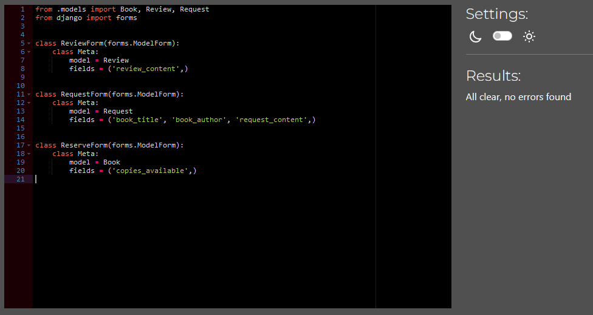

# CODERS LIBRARY
This is a simple DJango-based website for a library system to showcase and checkout books to users.

# Five UX Planes

## Strategy

Users will want a clean and easily digestible site. 
Users will want every page to be consistent. 
Users will want the ability to login and logout. 
Users will want the ability to see what books are available. 
Users will want the option to search for specific books by criteria. 
Users will want to be able to request specific books if they are unavailable. 
Users will want to be able to learn more about available books. 
Users will want to be able to reserve books for collection. 
Users will want to be able to review books. 
Users will want to be able to read reviews left by other users. 
Users will want to remain on the book they are viewing after submitting a review. 

Admins will want to be able to view book requests. 
Admins will want to be able to moderate and approve or disapprove reviews. 
Admins will want to be able to mark a book as returned to make it available. 

## Scope

The site should be cleanly presented, with all information clearly presented. 
The site should allow users to login and logout. 
The site should easily present a list of all available books for users to view. 
The site should have search functionality to allow users to filter book results. 
The site should have a form request to allow users to request books be added. 
The site should create dynamic views for each book to present more details information when a user accesses them. 
The site should have a button to allow users to request a book be reserved for collection. 
The site should disable this button if the book is currently unavailable. 
The site should have a form to allow users to submit reviews. 
The site should display approved reviews to users.

## Structure

In order to fulfill the users wants from the Strategy plane and the plans from the Scope plane I created a flowchart to understand how site flow. 

I also created a Entity-Relationship Diagram to get a better idea of what I would need to construct to make the site function as required. 

## Skeleton

A wireframes was drawn up before any code was written to understand how to present information on the home page. 

A wireframes was drawn up before any code was written to understand how to present information on the book list page. 

A wireframes was drawn up before any code was written to understand how to present information on the book details page. 

A wireframes was drawn up before any code was written to understand how to present information on the signup page. 

A wireframes was drawn up before any code was written to understand how to present information on the login and logout pages. 

## Surface

I wanted everything on the site to be presented cleanly. 

# Features

## Home
The site initially loads a view of the Home page which contains the name of the library and a brief "About Us" description. 

## Books
The site will display a list of books in the library's database and display them to the user. The user will be able to search and filter to find the books they want. 

### Request-Form
The Books List page has a button to prompt a modal to fill a form to leave a request for a specific book to be added to the library. 
Currently Non-Functional.

## Book-Details
The Books List contains more information about a book as well as shows any possible reviews the books may have been left by other users. 

### Reviews
This is simply an area of the Book-Details page which contains both a form to submit a review of a book as well as pre-existing and approved reviews. 

## Signup & Login & Logout-Form
These are simple forms to allow users to login or logout of the site. 

## Features Left to Implement

1. Search Functionality. 
    Could not figure out how to step through the data provided in the books.html due it using the Class view to display the entries. 

2. Request Functionality. 
    Had difficulty getting the crispy forms to function correctly in a modal. COuld not get the context data to be correctly added to the view for use. 

2. Checkout Functionality. 
    Had difficulty correctly accessing the required data in order to decrement the required value. 
    Forgot to add required attributes to the User class provided by the django.auth packages meaning I was unable to effectively add fields to hold any books held by a user. 

# Testing

|TEST|PROCESS|EXPECTATION|RESULT|
| -- | -- | -- | -- |
| Can an admin manually add new Database entries? | Using admin view to add new entries | The new entry should be added to the relevant table | SUCCESS |
| Do urls dynamically update to show various database entries? | Clicking into each book to view the url | The url would append an appropriate slug | SUCCESS |
| Can a user register? | Clicking to register | Be brought to the signup page | SUCCESS |
| Can a user register? | Clicking to register | Complete signup process | SUCCESS |
| Can a user login? | Clicking to login | Be brought to the login page | SUCCESS |
| Can a user login? | Clicking to login | Complete login process | SUCCESS |
| Can a user logout? | Clicking to logout | Be brought to the logout page | SUCCESS |
| Can a user logout? | Clicking to logout | Complete logout process | SUCCESS |
| Can a review be left on a book | Using the Form on the book-details page to leave a review | A review would be left | SUCCESS |
| Will a review be marked as in need of moderation by default? | Using the Form on the book-details page to leave a review | A review would require approval to be fully displayed | SUCCESS |
| Can a review be edited? | Using the button beneath a review to edit an existing review | The content of the review would be able to be altered | SUCCESS |
| Can only the original reviewer edit a review | Using the button beneath a review to edit an existing review | The review would not be able to be changed by other users | SUCCESS |
| Can a review be deleted? | Using the button beneath a review to delete an existing review | The review would prompt confirmation and be deleted if confirmed | SUCCESS|
| Can only the original reviewer delete  a review| Using the button beneath a review to delete an existing review | The review would not be able to be deleted | SUCCESS|
| Can an admin approve comments | Using the admin view to approve a comment | The comment should have its status updated to approved | SUCCESS |
| Can a user request a new book? | Clicking request a book button | Modal pop up displays with form for request submission | FAILED |
| Can a user search the database? | Entering search terms in the search bar | Relevant entries should display | FAILED |
| Can a user mark a book for reserve? | Clicking the reserve button on a book-details page | The book should be added to user's reserved books | FAILED |
| Can a user mark a book for reserve? | Clicking the reserve button on a book-details page | The books available should decrement | FAILED |
| Can a user mark a book for reserve? | Clicking the reserve button on a book-details page | The button should be disable for users with the book in reserve | FAILED |
| Does the reserve button update for users who have already reserved? | Clicking the reserve button changes it to a Return button | The button should dynamically swap | FAILED |
| Does the reserve button update for users who have already reserved? | Clicking the reserve button increments available books | The books available should increment | FAILED |
| Can a user unmark a book for reserve? | Clicking the return button on a book-details page | The book should be removed from user's reserved books | FAILED |
| Does the reserve button become disabled if there are no available books? | Trying to click the reserve button when the available books is less than 1 | The button should be disabled | SUCCESS |

# Validating

All functional code has been run through various linters and validators to ensure it is compliant with current web standards.

## Python
The books/admin.py file was fully checked in the CI Python Linter and returned no errors. 
 
The books/forms.py file was fully checked in the CI Python Linter and returned no errors. 
 
The books/models.py file was fully checked in the CI Python Linter and returned no errors. 
 
The books/urls.py file was fully checked in the CI Python Linter and returned no errors. 
 
The books/views.py file was fully checked in the CI Python Linter and returned no errors. 
 
The pp4codelibrary/admin.py file was fully checked in the CI Python Linter and returned no errors. 
 

## HTML
The Home page was fully HTML Valid. 
 
The Books page was fully HTML Valid. 
 
The Book Details page was fully HTML Valid. 
 
The Signup page was not fully Valid but appears to be throwing errors from the auth package templates rather than the signup page itself. 
 
The Login page was fully HTML Valid. 
 
The Logout page was fully HTML Valid. 
 

## CSS

## JavaScript
The reviews.js script validation. 
 
The request.js script validation. 
 
The reserve.js script is currently non functional and commented out to prevent any issues. 

# Bugs

Placeholder. 

1. Placeholder. 

2. Placeholder. 

# Deployment

This app will be deployed through Heroku by being linked to the Github repository. 
In order to deploy the site: 

1. I created the app in the Heroku Dashboard. 
2. I modified the Config Vars of the app to restrict the collection of static data. 
3. I installed gunicorn. 
4. I created a procfile to instruct heroku on which file to run. 
5. I added heroku as an allowed host in settings.py. 
6. I disabled DEBUG. 
7. I linked the heroku app to my GitHub repo. 
8. I clicked Deploy Branch. 

The live link can be found here - Placeholder

# Database Creation

This site will use a PostgreSQL database. 
In order to create and link the database: 

1. I used the CodeInstitute PostgreSQL tool. 
2. I created an env.py file and ensured it was listed in the .gitignore file. 
3. In env.py I imported python's os module. 
4. I set the value of DATABASE_URL to the url provided by CodeInstitute. 
5. I installed the required packages to connect my database and added them to requirements.txt 
6. I imported these packages and the env.py file into settings.py 
7. I replaced the existing sqlite3 database connections with my created database connection. 
8. I then created database tables using the migrate command. 
9. I created a superuser for the site and database. 
10. I deployed the project again. 
11. I added the DATABASE_URL to heroku's Config Vars.

# Model Creation

In order to add Models to the database:

1. I added the codeinstitute and heroku server urls to the CSRF_TRUSTED_ORIGINS 
1. I created the model in the models.py file. 
1. I assigned it's various attributes and values. 
1. I added any required Foreign Keys. 
1. I made migrations to the database table structure. 
1. I migrated the table to the database. 
1. I imported the model to the admin.py file. 
1. I registered the model in the admin.py file. 

# Serving Static Files

In order to allow Heroku to serve static files without relying on CDN:

1. I install the whitenoise package and add to requirements.txt.
2. I authorise the whitenoise packagae by adding it to the settings.text MIDDLEWARE.
3. I add a path to the STATIC_ROOT.
4. I run a command to collect all static files.
5. I create a runtime.txt file and add the used python version.
6. I delete the DISABLE_COLLECTSTATIC Config Vars I created for the initial deployment.
7. Heroku now runs collectstatic on each deployment.

# Allowing User Authentication

In order to allow users to register and login to the site:

1. I installed the django-allauth package and added it to requirements.txt.
2. I listed it in settings.txt under INSTALLED_APPS
3. I listed the site id as one as django can handle multiple and requires a specification.
4. I listed the login and logout redirects to point to the home page.
5. I listed the allauth middleware in settings MIDDLEWARE section.
8. I decided against adding email verification as a library may not require it.
9. I migrated the changes.
10. I included an "accounts" url path in the urls.py file.

# Creating a secondary host for images

In order to host uploaded images:

1. I install the cloudinary package to utilise the API and add it to requirements.txt.
2. In the env.py file I added the cloudinary url I generated for my account.
3. I add cloudinary to the INSTALLED_APPS list.
4. I import the package to the books/models file.
5. I migrate changes made to the models to allow for images.
6. I load the static directory to allow pages to access the images.

# Credits
The project was largely built upon the foundation laid by the Django Blog lessons provided by CodeInstitute.
